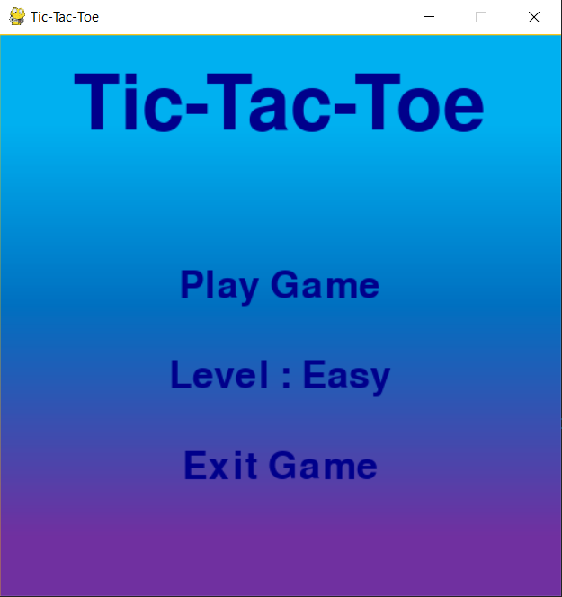
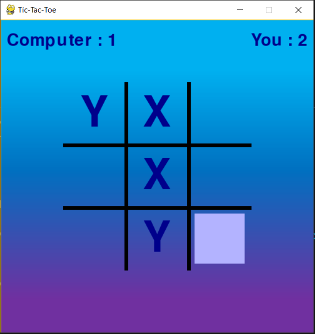

# Tic-Tac-Toe Game :sunglasses::fire:

## Table of Contents
1. [Game description](#game-description)
2. [Display pictures](#display-pictures)
3. [About the Code](#about-the-code) 
	- [Useful pygame functions](#useful-pygame-functions)
	- [Hovering effect of buttons](#hovering-effect-of-buttons)
	- [Strike line Animation](#strike-line-animation)
	- [Minimax algorithm](#minimax-algorithm)
4. [References](#references)

<br><br><br><br>
### <center>Game Description</center><br><br>
This game is also called noughts and crosses. It is a two player turn based game and consists of a 3x3 empty square in which the players can place their marks.<br><br>During their turn each player tries to place three of their marks in a horizontal, vertical, or diagonal row to win.<br><br> This game is so simple that it is often used as a pedagogical tool for teaching the concepts of good sportsmanship and the branch of artificial intelligence that deals with the searching of game trees.<br><br><br><br>
### <center>Display Pictures</center><br><br>

<br>

### <center>About the Code</center><br><br>

#### Useful pygame functions

**How to display a text on the screen** - For this we first need to make a font object which contains all the information about the font of our text.<br><br>
```my_font = pygame.font.SysFont(font_type,font_size,bold=False,italic=False)```<br><br>
font_type : It is the font you like your text to be in and that is available to your pygame module.<br>
font_size : It is the size of the text.<br>
bold : If this parameter is set to True then your font will be in bold.It is by default set to False.<br>
italic : If this parameter is set to True then yout font will be in Italic.It is also by default set to False.<br><br>
After you have made the font for your text then you need to get the text by rendering whatever you like to display through the font you made.<br><br>
```my_text = my_font.render(text_to_display,True,color)```<br><br>
text_to_display : It is the text we want to display .It can be anything.
color : It is the color we want our text to be in.It can be tuple containing the RGB(Red,Green,Blue) values of the color (example: (255,0,255) - this is purple), or we select a predefined color using pygame module (example : pygame.color('DarkBlue'))<br><br>
After we have our text we have to blit or paste it to our canvas.For this we use the ```blit()``` function<br><br>
```window.blit(my_text,(x_coordinate,y_coordinate))```<br><br>
window : It is the pygame canvas in which we are working. Every thing which is displayed is displayed here only.<br>It is initialised in the very beginning of the program.<br>```window = pygame.display.set_mode((screenWidth,screenHeight))```<br>my_text is assumed to be inside a rectangle whose dimensions are such that the text is tightly bounded by it.Then the x_coordinate and the y_coordinate are the x and y coordinates of the top-left corner of this rectangle.<br><br>
The work is not over yet.Even after pasting the text to the pygame window we still need the update the display of the window . To do this we use the command - <br>```pygame.display.update()```<br>This will update the display window and any changes we made can now be seen on the screen.<br><br><br><br>
**How to draw a line or a rectangle** - Drawing a line or a rectangle is very easy.<br>A line in pygame is defined by - <br>color : the color of the line<br>line_width : This means how thick the line is.<br>starting_position : This is a tuple containing the x and y coordinate of the starting point of the line.<br>ending_position : This is a tuple containing the x and y coordinates of the ending point of the line.<br>After we have decided all these parameters all we need to do is call the ```draw.rect()``` function<br>
```pygame.draw.line(window,color,starting_point,ending_point,line_width=1)```<br><br>
here again the color is a 3 length tuple (r,g,b) or predefined pygame.Color('Red')<br>
Also the starting_point and ending_point are also tuples (x,y)<br>
**It should be noted that the origin of the canvas is at top left and not bottom left. Also x coordinate increases from left to right and the y coordinate increases from top to bottom**<br><br>
Similar to the line , a rectangle is defined by its color , coordinates of the top-left corner and the dimension of the rectangle . The sides of the rectangle are parallel to the x and y axis.<br><br>
```pygame.draw.rect(window,color(x_coordinate_top_left_point,y_coordinate_top_left_point,rectangle_width,rectangle_height))```<br><br><br>
**How to get mouse position and the state of mouse buttons** - pygame offers functions which can return the current position of the mouse pointer and also the states of the mouse buttons.<br>To get the postition of the mouse buttons use - <br>```mouseX,mouseY = pygame.mouse.get_pos()```<br><br>This function will return a tuple of the x and y coordinates of the mouse. This coordinates will be stored in the mouseX and mouseY and can used later.<br>Similaryl to get the state of mouse buttons we can use -<br>```mouse_button_1,mouse_button_2,mouse_button_3 = pygame.mouse.get_pressed()```<br>This functions returns a tuple of boolena values. The value of mouse_button_i is true if the ith mouse button is pressed , false otherwise.<br>
mouse_button_1 is the left button on our mouse and the mouse_button_2 is the right button on our mouse. And the mouse_button_3 depends on the type of our mouse.<br><br><br><br>
#### Hovering effect of buttons
This game also has a hovering effect on all the buttons.This can be done very easily.To do this all we need to this is call a function **check_hovering()** which will check is the position of the mouse is above the text. In the ' how to display a text' section above i have written that the text can be assumed to be in a rectangle.The width,height and position of this rectangle can be easily obtained.<br>
To get the height : ```my_text.get_height()```<br>
To get the width : ```my_text.get_width()```<br>
The position of the display text is set by us so it will be available to us.<br>
From this information we can check that if the mouse is in this rectangle then the we can change the color of the text and update the display.<br><br>
To check the if mouseX and mouseY is in the rectangle , all we need to check is whether - <br>```rectangle_left_side<=mouseX<=rectangle_right_side and rectangle_upper_side<=mouseY<=rectangle_lower_side```<br>
Also we need to place this **check_hovering()** in the main game loop so it is called again and again after reguler time intervals.<br><br><br><br>
#### Strike Line Animation
When any player wins , a strike line is drawn where that player has three marks in one line.<br>
This line has a small animation which gives the feeling that someone is striking the three marks on the winning player.<br>This can be done very easily.<br>All we need to do is get the starting and ending points.<br>Let they be startX,startY and endX,endY<br>Let ```deltaX = endX - startX```and ```deltaY = endY-startY```<br>Now lets also assume a ```fractionValue = 0``` <br>Now lets assume ```movingX = startX + deltaX*fractionValue``` and ```movingY = startY + deltaY*fractionValue``` <br>Now if take the value of fractionValue from 0 to 1 , then the movingX and movingY will go from startX,startY to endX,endY respectively.<br> Now all we need to do is draw a line from startX,startY to movingX,movingY and also keep increasing the fractionValue in the game loop.<br>This will give an effect of a line being drawn from startX,startY to endX,endY.<br><br><br><br>
#### Minimax Algorithm
The game has two difficulty levels , easy and hard. In the easy level the computer selects at random a postition from all the available postions and then marks there.<br>But in the hard level this is not the case.The computer this time smartly selects such a postion in the grid which would make the computer win or  end the game in a draw.<br>To do this we use the Minimax algorithm.This is a very simple and intuitive algorithm.It can be easily understood and implemented.<br>The basic idea is this - when the computer has to make a choice as to where to place its mark.Then it first recursively checks all the possible positions where it can move.From all these paths it will then select the best possible path.<br>
Here is one assumption - that the opponent (that is us) will always make the most optimal move in his/her favour. If this is not the case , its even better for the computer.<br>To know more about the Minimax algorithm go see this video - [Playing Games Perfectly With Minimax](https://www.youtube.com/watch?v=EI6vb82I9-o)<br><br><br><br>
### <center>References</center><br><br>
Here are some references for learning more about this project.<br>
For pygame functions and examples
- [pygame documentaion](https://www.pygame.org/docs/)

For learning about Minimax algorithm
- [wikipedia page for Minimax](https://en.wikipedia.org/wiki/Minimax)
- [geeks for geeks article on Minimax](https://www.geeksforgeeks.org/minimax-algorithm-in-game-theory-set-1-introduction)
